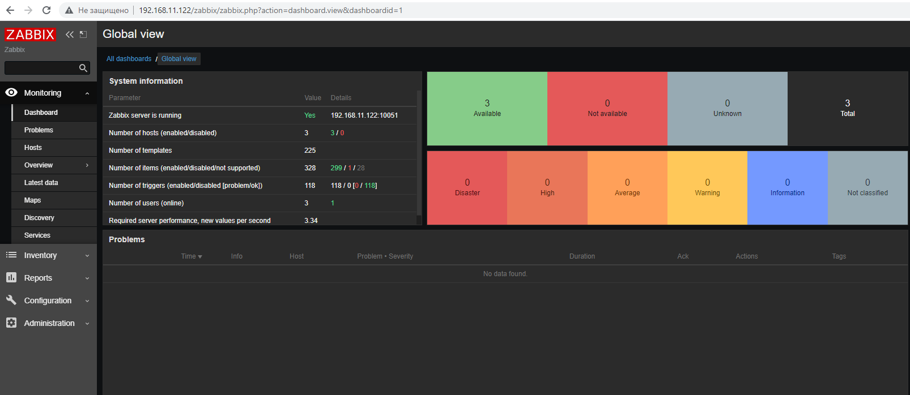
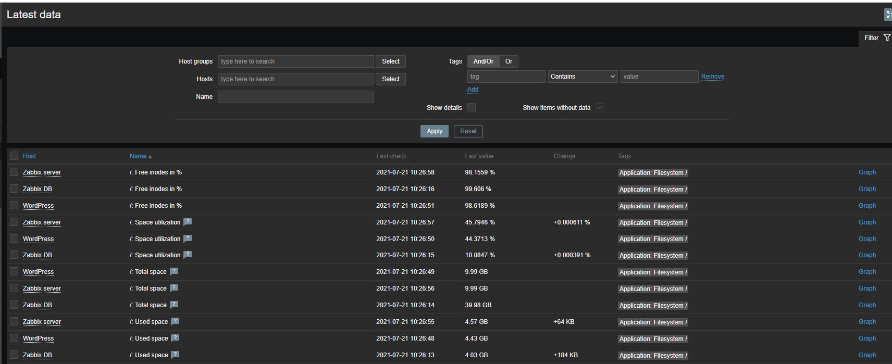

## ДЗ к Занятию 20
 
Prometheus, Zabbix 

## Задание 1

Настроить дашборд с 4-мя графиками: память, процессор, диск, сеть.

Настроить на одной из систем: zabbix (использовать screen (комплексный экран)), prometheus - grafana.

В качестве результата прислать скриншот экрана - дашборд должен содержать в названии имя приславшего.

## Решение задания 1

### 1. Развертывание стенда мониторинга Zabbix.

Стенд мониторинга включает в себя 3 ВМ. 
 BM1 - СУБД Postgres c бд для работы Zabbix (IP - 192.168.11.121)
 ВМ2 - Apache+Zabbix (IP - 192.168.11.122)
 BM3 - WordPress как тестовый сервер. (IP - 192.168.11.124)
 
 Первоначальное развертывание ВМ1 выполнялось с помощью vagrant. Файл vagrantfile размещен в папке vagrant_vm_db. 
 СУБД Postgres разворачивалась с помощью ansible playbook. Данный playbook запускался с отдельной ВМ настроенной для управления ansible. PlayBook размещен в папке ans_postgres. 
 
 Развертывание ВМ2 выполнялось с помощью vagrant. Файл vagrantfile размещен в папке vagrant_vm_zabbix. С помощью данного файла выполняется развертывание и настройка   Apache + Zabbix
 
 Настройка БД Postgresql выполнялась руками.
 
 Развертывание ВМ3 выполнялось с помощью vagrant.  Файл vagrantfile размещен в папке vagrant_wordpress. После окончания развертывания для окончательной настройки необходимо подключиться по адресу: http://192.168.11.124/
 
 
  
 ### 2.Последовательность действий по  настройке БД Postgres на ВМ1.
 
 ### На ВМ2 :
 
1. Копируем схемы DB на сервер БД (ВМ 1) в профиль postgres

       sudo scp /usr/share/doc/zabbix-sql-scripts/postgresql/create.sql.gz vagrant@192.168.11.121:/home/vagrant
 
### На сервере БД (ВМ2) Выполняем следующие действия:

1. Копируем файл /home/vagrant/create.sql.gz в /home/postgres

       cp /home/vagrant/create.sql.gz /home/postgres

2. Делаем владельцев перенесенного файла postgres

       sudo chown postgres:postgres create.sql.gz

3. Создаем пользователя zabbix в СУБД:
     
       sudo -u postgres createuser --pwprompt zabbix

3. Создаем базу данных zabbix 

   	sudo -u postgres createdb -O zabbix zabbix
	
 4. Создаем объекты БД из файла create.sql.gz. Выполняем команду ниже из под пользователя postgres
	
        zcat /usr/share/doc/zabbix-server-pgsql/create.sql.gz | psql -U zabbix -d zabbix
         
После выполнения настроек выполняем первый вход в zabbix: http://192.168.11.122/zabbix

### 3. Настройка агента zabbix на ВМ, которые необходимо поставить на мониторинг
1. Устанавливаем пакет

        dnf -y install zabbix-agent
	
2. Редактируем параметры конфигурационного файла /etc/zabbix/zabbix_agentd.conf

       PidFile=/var/run/zabbix/zabbix_agentd.pid
       LogFile=/var/log/zabbix/zabbix_agentd.log
       LogFileSize=0
       Server=192.168.11.122
       ServerActive=192.168.11.122
       Hostname=anstest2
       Include=/etc/zabbix/zabbix_agentd.d/*.conf

3. Выполняем настройку сервиса агента zabbix

       sudo systemctl start zabbix-server zabbix-agent httpd php-fpm
       sudo systemctl enable zabbix-server zabbix-agent httpd php-fpm

### 4.  Постановка объектов на мониторинг в Zabbix

## Подключеные ВМ к Zabbix.
К системе мониторинга Zabbix были подключены 3 ВМ.

После подключения серверов к Zabbix пошел сбор данных

## Комплексный экран для мониторинга ВМ3 (WordPress)

Дополнительно настроен мониторинг хостовой машины под управлением Windows.

 

