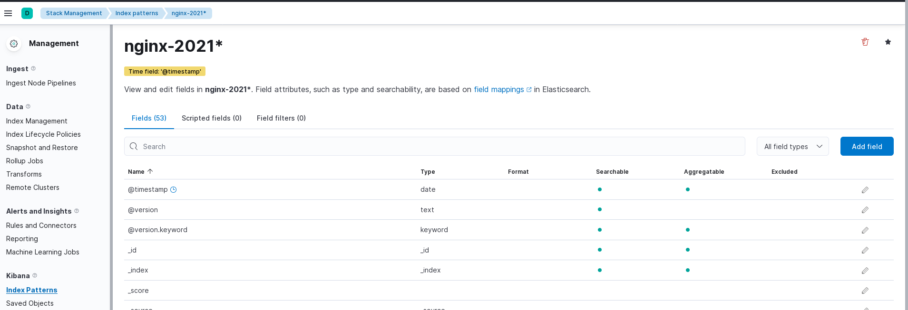

## ДЗ к Занятию 23

Сбор и анализ логов

### Задание 1

Настраиваем центральный сервер для сбора логов

1. в вагранте поднимаем 2 машины web и log

2. на web поднимаем nginx

3. на log настраиваем центральный лог сервер на любой системе на выбор: journald, rsyslog, elk.

4. настраиваем аудит, следящий за изменением конфигов nginx

Все критичные логи с web должны собираться и локально и удаленно. Все логи с nginx должны уходить на удаленный сервер (локально только критичные). Логи аудита должны также уходить на удаленную систему.

### Решение задания 1

Для выполнения задания выбран сервер rsyslog.

### 1.1. Три виртуальные машины разварачиваю с помощью vagnatfile. (имя файла - vagrantfile)

Параметры сервера сбора logs: имя - serverlog,  ip-адрес: 192.168.11.230

Параметры клиента c которого собираю logs: имя - clientlog, ip адрес: 192.168.11.231

Дополнительно разварачивается ВМ serverelk для выполнения задания 2. Параметры: имя - serverelk, ip адрес: 192.168.11.232

### Дополнительно:
### 1.2. Для развертывания playbook ansible дополнтельно развернута ВМ с установленным ansible и создана учетная запись ansible для выполнения playbook.

Файл для развертывания через vagrant - vagrantfile_ansible

Параметры ВМ: имя - , ip адрес: 192.168.11.2

Учетной записи ansible создан ssh-key:

    ssh-key -t rsa
    
#### 1.2.1 После развертывания ВМ serverlog и clientlog выполняем перенос публичного ключа пользователю ansible.Данная учетка создается в процессе развертывания ВМ.

    ssh-copy-id -i ~/.ssh/id_rsa.pub ansible@192.168.11.230
    ssh-copy-id -i ~/.ssh/id_rsa.pub ansible@192.168.11.231
    ssh-copy-id -i ~/.ssh/id_rsa.pub ansible@192.168.11.232
    
    password для учетки ansible: ansible
    
#### 1.2.2. Содержимое каталога provisioning переносим в /etc/ansible, предварительно все удалив из него.

Для проверки правильности настроек ansible и возможности выплнения playbook выполняем команду:

    ansible -m ping all
    
#### 1.2.3 Выполняем установку и настройку серверной и клиентской частей rsyslog c помощью playbook.yml.
 
    ansible-play playbook.yml

### 1.3. Для работы стенда использую следующие конфигурационные файлы:

#### 1.3.1 Сервер - /etc/rsyslog.conf

        #### MODULES ####
        module(load="imuxsock"    # provides support for local system logging (e.g. via logger command)
            SysSock.Use="off") # Turn off message reception via local log socket; 
                                # local messages are retrieved through imjournal now.
        module(load="imjournal"             # provides access to the systemd journal
            StateFile="imjournal.state") # File to store the position in the journal
        module(load="imudp") # needs to be done just once
        input(type="imudp" port="514")
        module(load="imtcp") # needs to be done just once
        input(type="imtcp" port="514")

        #### GLOBAL DIRECTIVES ####
        global(workDirectory="/var/lib/rsyslog")
        module(load="builtin:omfile" Template="RSYSLOG_TraditionalFileFormat")
        include(file="/etc/rsyslog.d/*.conf" mode="optional")
        #### RULES ####

        $template RemoteLogs,"/var/log/rsyslog/%HOSTNAME%/%PROGRAMNAME%.log"
        *.* ?RemoteLogs
        $template HostAudit, "/var/log/rsyslog/%HOSTNAME%/audit.log"
        local6.* ?HostAudit
        & ~

        #kern.*                                                 /dev/console

        *.info;mail.none;authpriv.none;cron.none                /var/log/messages

        authpriv.*                                              /var/log/secure

        mail.*                                                  -/var/log/maillog

        cron.*                                                  /var/log/cron

        *.emerg                                                 :omusrmsg:*

#### 1.3.2. Web сервер

##### /etc/rsyslog.conf

        #### MODULES ####
        module(load="imuxsock"    # provides support for local system logging (e.g. via logger command)
            SysSock.Use="off") # Turn off message reception via local log socket; 
                                # local messages are retrieved through imjournal now.
        module(load="imjournal"             # provides access to the systemd journal
            StateFile="imjournal.state") # File to store the position in the journal

        #### GLOBAL DIRECTIVES ####
        global(workDirectory="/var/lib/rsyslog")
        module(load="builtin:omfile" Template="RSYSLOG_TraditionalFileFormat")
        include(file="/etc/rsyslog.d/*.conf" mode="optional")

        #### RULES ####
        #kern.*                                                 /dev/console
        #*.info;mail.none;authpriv.none;cron.none                /var/log/messages
        #authpriv.*                                              /var/log/secure
        # mail.*                                                  -/var/log/maillog
        #cron.*                                                  /var/log/cron
        #*.emerg                                                 :omusrmsg:*
        #uucp,news.crit                                          /var/log/spooler
        #local7.*                                                /var/log/boot.log

##### /etc/rsyslog.d/audit.conf - для передачи данных аудита 

        $ModLoad imfile
        $InputFileName /var/log/audit/audit.log
        $InputFileTag tag_audit_log:
        $InputFileStateFile audit_log
        $InputFileSeverity info
        $InputFileFacility local6
        $InputRunFileMonitor

        *.*   @@192.168.11.230:514

 
##### /etc/syslog.d/auth.conf - для передачи данных аутоидентификации
        
        auth.*@@192.168.11.230:514

##### /etc/nginx/nginx.conf

        user nginx;
        worker_processes auto;
        error_log /var/log/nginx/error.log;
        pid /run/nginx.pid;

        include /usr/share/nginx/modules/*.conf;

        events {
            worker_connections 1024;
        }

        http {
            log_format  main  '$remote_addr - $remote_user [$time_local] "$request" '
                            '$status $body_bytes_sent "$http_referer" '
                            '"$http_user_agent" "$http_x_forwarded_for"';

                access_log  /var/log/nginx/access.log  main;
                error_log  /var/log/nginx/error.log warn;

                error_log syslog:server=192.168.11.230:514,facility=local1,tag=nginx_log,severity=error;
                access_log syslog:server=192.168.11.230:514,facility=local1,tag=nginx_access,severity=info main; 

            sendfile            on;
            tcp_nopush          on;
            tcp_nodelay         on;
            keepalive_timeout   65;
            types_hash_max_size 2048;

            include             /etc/nginx/mime.types;
            default_type        application/octet-stream;

            include /etc/nginx/conf.d/*.conf;

            server {
                listen       80 default_server;
                listen       [::]:80 default_server;
                server_name  _;
                root         /usr/share/nginx/html;

                include /etc/nginx/default.d/*.conf;

                location / {
                }

                error_page 404 /404.html;
                    location = /40x.html {
                }

                error_page 500 502 503 504 /50x.html;
                    location = /50x.html {
                }
            }

        }

В данном файле выполнена настройка передача данных на сервер rsyslog. На сервер передаются ошибки и любые действия связанные с авторизацией. Также все лог файлы сохраняются локально.

### 1.4. В итоге на сервере в каталоге /var/log/rsyslog/clientlog собираются следующие log файлы

        rwx------. 2 root root  253 Aug  8 15:34 .
        drwx------. 4 root root   40 Aug  8 14:19 ..
        -rw-------. 1 root root   80 Aug  8 15:01 CROND.log
        -rw-------. 1 root root  484 Aug  8 15:20 anacron.log
        -rw-------. 1 root root 4533 Aug  8 15:55 audit.log
        -rw-------. 1 root root 1202 Aug  8 14:40 dbus-daemon.log
        -rw-------. 1 root root  146 Aug  8 15:55 dnf.log
        -rw-------. 1 root root  402 Aug  8 15:34 nginx_access.log
        -rw-------. 1 root root  502 Aug  8 15:34 nginx_log.log
        -rw-------. 1 root root  585 Aug  8 14:40 rsyslogd.log
        -rw-------. 1 root root  324 Aug  8 15:01 run-parts.log
        -rw-------. 1 root root 3044 Aug  8 14:40 setroubleshoot.log
        -rw-------. 1 root root  394 Aug  8 15:55 systemd.log
        -rw-------. 1 root root 4533 Aug  8 15:55 tag_audit_log.log

### Решение задания 2.
Для развертывания сервера EKL и настройки сбора log nginx разработал playbook Ansible. Данный playbook размещен в каталоге: provision_elk

Его работа проверялась путем запуска с управляющей ВМ.

#### 2.1. ДЛя развертывания elk? cодержимое каталога provisioning_elk переносим в /etc/ansible управляющей ВМ (192.168.11.2) , предварительно все удалив из него.

  
#### 2.2. Выполняем установку и настройку серверной elk (elasticsearch, logstash, kibana) и клиентской частей на clientlog (filebeat) c помощью playbook_elk.yml.
 
    ansible-play playbook_elk.yml
    
### 2.3. После выполнения playbook проверяем работу развернутых сервисов.

#### 2.3.1 На ВМ serverelk.

    systemctl status elasticsearch.service
    systemctl status logstash
    systemctl status kibana
   
#### 2.3.2. На ВМ clientlog:

    systemctl status filebeat

### 2.4. Выполняем подключение к elk через kibana и выполняем первоначальную настройку для анализа logs nginx.

